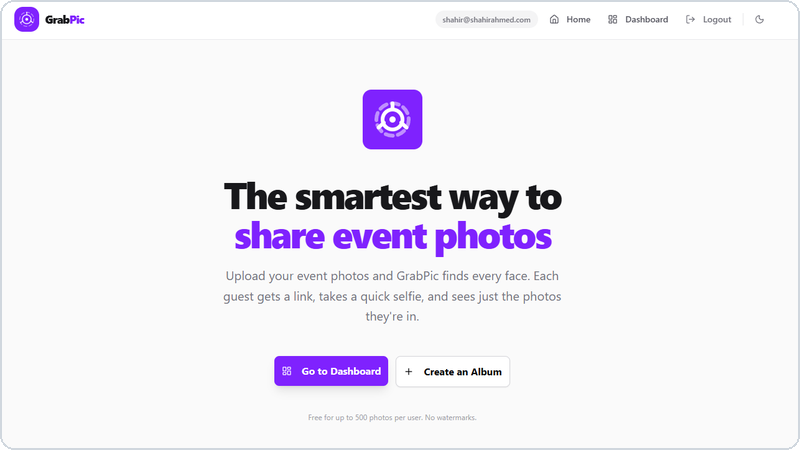
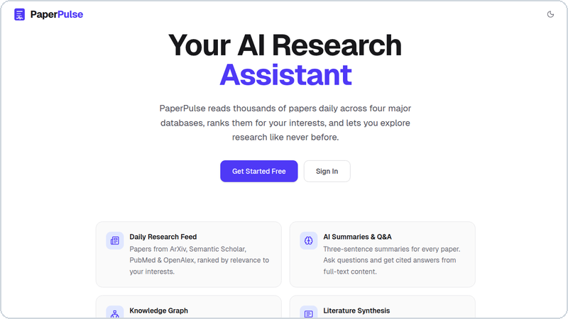
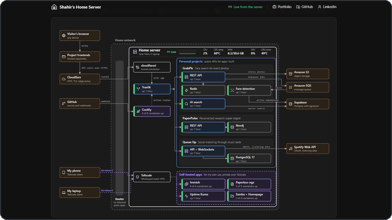
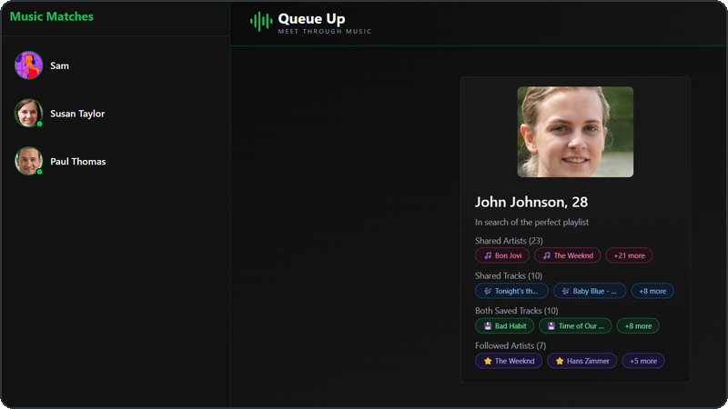
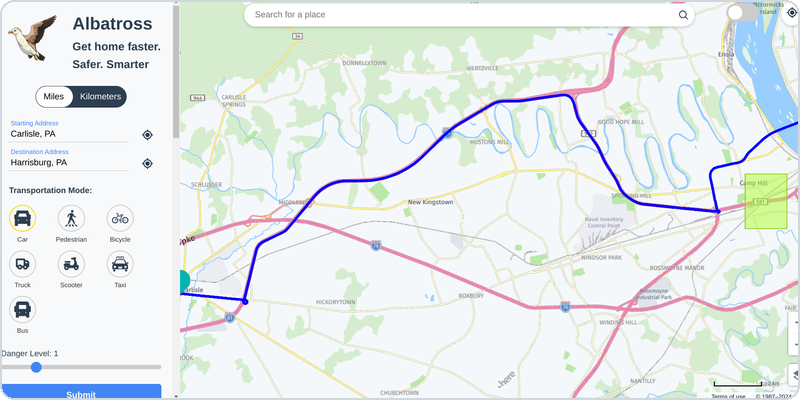
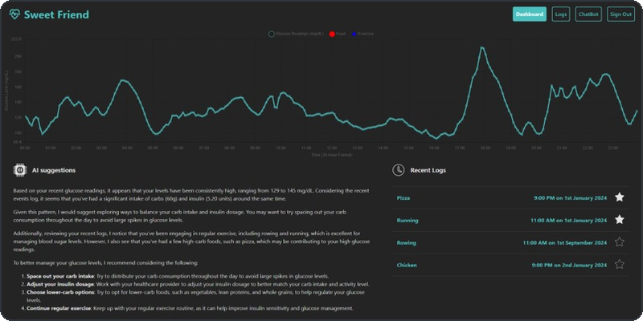

<h2> 𝐇𝐞𝐥𝐥𝐨 𝐭𝐡𝐞𝐫𝐞, 𝐟𝐞𝐥𝐥𝐨𝐰 <𝚍𝚎𝚟𝚎𝚕𝚘𝚙𝚎𝚛𝚜/>! </h2>

  
You have finally discovered my GitHub profile.  
Please feel free to clone/fork projects, raise issues and submit PRs if you think something could be better.  
Ask me anything <a href="https://github.com/Shahir-47/Shahir-47/issues/new"><b>here</b></a> 
or <a href="mailto:shahir.a@nyu.edu"><b>email</b></a> me.

<i>Happy Coding!</i>
 

 

<h2 align="center">About me</h2>

 

Hi, I'm **Shahir Ahmed**, a software engineer in New York working on my Master's in Computer Science at NYU.

Before NYU, I worked at [Sarva](https://www.sarvabazaar.com), an inventory management startup.

Most of what I build is full-stack, usually a Next.js or React frontend talking to a Spring Boot or FastAPI backend. My newer projects run on a [home server](https://lab.shahirahmed.com) I set up on an old gaming laptop.

I also contribute to [Mermaid.js](https://github.com/mermaid-js/mermaid), where I'm ranked 25th out of 600+ contributors.

 

  
  
  
  
  
  

 

<h2 align="center">Projects</h2>

 

<i>Consider giving my work a star to show some love.</i>

<table align="center">
  <tr>
    <td width="50%" align="center" valign="top">
       
      
      <h3>GrabPic</h3>
      
 

      
Guests take a selfie after an event and get only the photos they're in, so nobody has to dig through the whole album. &nbsp;

    </td>
    <td width="50%" align="center" valign="top">
       
      
      <h3>PaperPulse</h3>
      
 

      
Every morning it finds the 25 new research papers that matter most to you, and you can ask it questions about any of them. &nbsp;

    </td>
  </tr>
</table>
<table align="center">
  <tr>
    <td width="50%" align="center" valign="top">
       
      
      <h3>Home Server</h3>
      
 

      
An old gaming laptop that hosts my apps for about $1 a month instead of $100 on AWS. &nbsp;

    </td>
    <td width="50%" align="center" valign="top">
       
      
      <h3>Queue Up</h3>
      
 

      
Matches you with people who listen to the same music, based on your Spotify history, and lets you chat when it's mutual. &nbsp;

    </td>
  </tr>
</table>
<table align="center">
  <tr>
    <td width="33%" align="center" valign="top">
      <h3>CoSign</h3>
      
 

      
A to-do app where someone you pick has to sign off on your work. Miss the deadline and they get the penalty you wrote. &nbsp;

    </td>
    <td width="33%" align="center" valign="top">
      <h3>PandOS</h3>
      

      
An operating system kernel I wrote in C. It runs up to 20 processes at once and gives each one its own virtual memory. &nbsp;

    </td>
    <td width="33%" align="center" valign="top">
      <h3>BitTorrent Client</h3>
      

      
Downloads files from .torrent files and magnet links by connecting straight to other peers. I wrote the protocol from scratch in Node.js. &nbsp;

    </td>
  </tr>
</table>

 

<h2 align="center">Hackathons</h2>

 

<table align="center">
  <tr>
    <td width="50%" align="center" valign="top">
       
      
      <h3>Albatross</h3>
      
<i>Built at HackHarvard 2024</i>

      
  

      
A walking route planner that keeps you out of crime hot zones in Boston. I built the Vue.js frontend that draws the map. &nbsp;

    </td>
    <td width="50%" align="center" valign="top">
       
      
      <h3>SweetFriend</h3>
      
<i>Built at PennApps 2024</i>

      
  

      
Estimates the carbs in a meal from a photo and shows it next to live glucose readings. We built it for a teammate with type 1 diabetes. &nbsp;

    </td>
  </tr>
</table>

 

<h2 align="center">Open Source</h2>

 

<table>
  <tr>
    <td width="80" align="center" valign="top"> </td>
    <td valign="top">
      
      
<b><a href="https://github.com/mermaid-js/mermaid">Mermaid.js</a></b>

      

        
        
        
      

      
The tool GitHub and Microsoft use to turn text into diagrams. What I've added:

      <ul>
        <li>
<a href="https://github.com/mermaid-js/mermaid/pull/6225">Title color, font, and size options</a> for journey diagrams
</li>
        <li>
<a href="https://github.com/mermaid-js/mermaid/pull/6274">Word wrapping</a> so long legend labels stop running into the diagram
</li>
        <li><a href="https://github.com/mermaid-js/mermaid/pull/6475">Data labels</a> that fit inside the bars of XY charts &nbsp;</li>
      </ul>
    </td>
  </tr>
</table>

My <a href="https://github.com/Shahir-47/open-source-contributions">open source portfolio</a> has every project I've contributed to, with a link to each merged pull request.

 

<h2 align="center">Where I've worked</h2>

 

<table>
  <tr>
    <td width="80" align="center" valign="top"> </td>
    <td valign="top">
      
      
<b><a href="https://www.sarvabazaar.com">Sarva</a></b> <i>Software engineer</i>

      <ul>
        <li>
Built a voice assistant that lets store owners update their inventory by talking in their own language
</li>
        <li>Set up the CI pipelines that test every API before it ships &nbsp;</li>
      </ul>
    </td>
  </tr>
  <tr>
    <td width="80" align="center" valign="top"> </td>
    <td valign="top">
       
      
<b><a href="https://github.com/FarmData2/FarmData2">FarmData2</a></b> <i>Software engineer intern</i>

      <ul>
        <li>
Open source record keeping for vegetable farms, where I built the APIs that log crops automatically
</li>
        <li>Ended up as the project's <a href="https://github.com/FarmData2/FarmData2/graphs/contributors">2nd top contributor</a> &nbsp;</li>
      </ul>
    </td>
  </tr>
  <tr>
    <td width="80" align="center" valign="top"> </td>
    <td valign="top">
       
      
<b>Dickinson College</b> <i>Teaching assistant</i>

      <ul>
        <li>Ran weekly Python and Java code reviews and office hours for six semesters &nbsp;</li>
      </ul>
    </td>
  </tr>
  <tr>
    <td width="80" align="center" valign="top"> </td>
    <td valign="top">
       
      
<b>84 Lumber</b> <i>Volunteer software engineer</i>

      <ul>
        <li>
Wrote a translator that turns the company's old CBASIC code into Python and Java
</li>
        <li>Featured in <a href="https://www.dickinson.edu/news/article/5821/dickinson_students_work_with_alum_to_breathe_new_life_into_84_lumbers_legacy_systems">Dickinson News</a> &nbsp;</li>
      </ul>
    </td>
  </tr>
</table>

 

<h2 align="center">Tech Stack</h2>

 

<table>
  <tr>
    <td width="150" valign="top"> <b>Languages</b></td>
    <td valign="top">
       
      
      
      
      
      
      
      
      
       &nbsp;
    </td>
  </tr>
  <tr>
    <td width="150" valign="top"> <b>Frontend</b></td>
    <td valign="top">
       
      
      
      
      
      
       &nbsp;
    </td>
  </tr>
  <tr>
    <td width="150" valign="top"> <b>Backend</b></td>
    <td valign="top">
       
      
      
      
      
      
       &nbsp;
    </td>
  </tr>
  <tr>
    <td width="150" valign="top"> <b>Databases</b></td>
    <td valign="top">
       
      
      
      
      
      
      
       &nbsp;
    </td>
  </tr>
  <tr>
    <td width="150" valign="top"> <b>Cloud & DevOps</b></td>
    <td valign="top">
       
      
      
      
      
      
      
      
      
      
      
       &nbsp;
    </td>
  </tr>
  <tr>
    <td width="150" valign="top"> <b>AI & APIs</b></td>
    <td valign="top">
       
      
      
      
      
       &nbsp;
    </td>
  </tr>
  <tr>
    <td width="150" valign="top"> <b>Testing</b></td>
    <td valign="top">
       
      
      
       &nbsp;
    </td>
  </tr>
</table>

 

<h2 align="center">Education</h2>

 

<table>
  <tr>
    <td width="80" align="center" valign="top"> </td>
    <td valign="top">
      
      
<b>New York University</b> <i>Sep 2026 - May 2028 (expected)</i>

      
M.S. in Computer Science &nbsp;

    </td>
  </tr>
  <tr>
    <td width="80" align="center" valign="top"> </td>
    <td valign="top">
       
      
<b>Dickinson College</b> <i>Aug 2021 - May 2025</i>

      
B.S. in Computer Science &amp; Mathematics, GPA 3.52/4.00

      
Cum Laude, Dean's List, Pi Mu Epsilon, The 1783 Scholarship &nbsp;

    </td>
  </tr>
</table>

 

<h2 align="center">Certifications</h2>

 

<table>
  <tr>
    <td width="80" align="center" valign="top"> </td>
    <td valign="top">
      
      
<b>CS50x: Introduction to Computer Science</b> <i>HarvardX</i>

      

      
Harvard's intro course, where I learned C and memory management before moving on to Python, SQL, and Flask. &nbsp;

    </td>
  </tr>
  <tr>
    <td width="80" align="center" valign="top"> </td>
    <td valign="top">
       
      
<b>MATLAB Onramp</b> <i>MathWorks</i>

      

      
An intro course on working with matrices, plotting data, and writing MATLAB scripts. &nbsp;

    </td>
  </tr>
</table>

 

<h2 align="center">GitHub Stats</h2>

 

 

<h2 align="center">Random dev joke for you!</h2>

 

---

<i>Follow me around the web:</i> 

 

   

